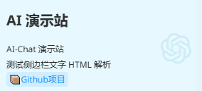

# ChatGPT Next Web 二创
> 原项目：[ChatGPTNextWeb](https://github.com/ChatGPTNextWeb/ChatGPT-Next-Web)


**分歧节点：2.12.3，侧重维护 OpenAI 类型渠道**

docker 镜像：
- dockerhub 托管: `justma/chatgpt-next-chat:latest`
- github  托管: `ghcr.io/qabot-zh/chatgpt-next-chat:latest`

## 二开新增特性

- 模型选择器优化
- 快速搜索聊天记录
- 可自定义**侧边栏**，支持 HTML 样式
- 免导入导出的云备份功能（需配合[文件服务器项目](https://github.com/QAbot-zh/go-file-server)使用）：[文件服务器搭建参考](#平台搭建)
- OpenAI 类型支持前端配置，一键拉取可用模型


- 基于 AI 模型的中英互译

   - 翻译前

  
  
   - 翻译后
   
   

- 基于 AI 模型的 OCR

  - OCR 前

  

  - OCR 后

  

- 基于正则匹配的隐私打码（**所有基于 AI 模型的功能的信息安全请自行把握，包括上述的翻译和 OCR，打码功能不基于 AI 实现**）

   - 打码前

    

   - 打码后

    


- 支持 details、summary 标签渲染，增强页面整洁度、交互性和趣味性

   

- 适配 `<think>` 标签包裹和以 reasoning_content 参数传递的思考过程，泛化性强

  - 思考中

  
  
  - 思考结束
  
  


## 环境变量

> [简体中文 > 如何配置 api key、访问密码、接口代理](./README_CN.md#环境变量)

（一些重要的环境变量）

| 环境变量名称               | 描述       |
|----------------------------|---------------------------------------------|
| `CODE`                    | 可选。授权码，支持英文逗号分隔多个 code。|
| `OPENAI_API_KEY`          | 必选。OpenAI API 密钥，支持英文逗号分隔多个 key。|
| `BASE_URL`                | 可选。自定义 OpenAI API 请求的基础 URL，例如 `http://your-openai-proxy.com`，默认值：`https://api.openai.com`。|
| `OPENAI_ORG_ID`           | 可选。指定 OpenAI 组织 ID。|
| `HIDE_USER_API_KEY`       | 可选。设置为 `1` 禁止用户在前端输入自己的 API 密钥，默认值为空。|
| `DISABLE_GPT4`            | 可选。设置为 `1` 禁止用户使用 GPT-4 及其相关高级模型（如 `gpt-4/chatgpt-4o`），默认值为空。|
| `ENABLE_BALANCE_QUERY`    | 可选。设置为 `1` 允许用户查询 API 余额，默认值为空。|
| `DISABLE_FAST_LINK`       | 可选。设置为 `1` 禁止通过 URL 解析参数，默认值为空。|
| `CUSTOM_MODELS`           | 可选。自定义模型列表：<br> · 使用 `+` 添加模型<br> · 使用 `-` 隐藏模型<br> · 使用 `name=displayName<description>` 自定义模型名称<br> · 支持`<>`添加模型描述<br> · 支持通过 `-*provider` 禁用特定模型，`+*provider` 启用特定模型，`-all` 禁用所有默认模型，`+all` 启用所有默认模型，默认值为空。 <br> · 示例：`-*Azure,+claude-2,-gpt-3.5-turbo,deepseek-reason@OpenAI=DeepSeek-R1<深度求索 DeepSeek-R1 推理模型，热烈推荐>`。|
| `SIDEBAR_TITLE`           | 可选。设置侧边栏标题，默认值为空。|
| `SIDEBAR_SUBTITLE`        | 可选。设置侧边栏子标题，支持 HTML 解析，默认值为空。|
| `SITE_TITLE`              | 可选。设置网站顶部标题，默认值为空。|
| `COMPRESS_MODEL`          | 可选。设置标题生成和历史压缩模型，默认值：`gpt-4o-mini`。|
| `TRANSLATE_MODEL`         | 可选。设置翻译模型，默认值：`gpt-4o-mini`。|
| `OCR_MODEL`               | 可选。设置 OCR 模型，默认值：`gpt-4o-mini`。|
| `CUSTOM_HELLO`            | 可选。自定义招呼语，覆盖默认的 `bot_hello`。|
| `UNAUTHORIZED_INFO`       | 可选。自定义错误提示，覆盖默认的提示词，默认值为空。|
| `WHITE_WEBDEV_ENDPOINTS`  | 可选。增加允许访问的 WebDAV 服务地址，每个地址需为完整的 endpoint，例如：`https://xxxx/yyy`，多个地址用逗号分隔，默认值为空。|
| `DEFAULT_INPUT_TEMPLATE`  | 可选。自定义默认模板，用于初始化设置中的用户输入预处理配置项，默认值为空。|
| `VISION_MODELS`           | 可选。设置具备视觉能力的模型，多个模型用英文逗号分隔，用于补充内置视觉能力模型，默认值为空。|
| `ICON_POSITION`           | 可选。设置消息功能图标的位置，候选项：UP,DOWN,BOTH。默认值为 DOWN（对手机窄屏使用更友好）。|


------

关键示例：

### `CUSTOM_MODELS`： **支持通过<>设置模型描述**


### `SIDEBAR_SUBTITLE` ：**侧边栏子标题，支持html解析**

- html 示例：
```
<br>
<div style="line-height: 1.8;">
   <div>AI-Chat 演示站</div>
   <div>测试侧边栏文字 HTML 解析</div>
   <a href="https://github.com/QAbot-zh/ChatGPT-Next-Web" 
      style="color: #1890ff;
               text-decoration: none;
               font-weight: 500;
               transition: all 0.3s ease;
               padding: 2px 4px;
               border-radius: 4px;
               background-color: rgba(24,144,255,0.1);">
      <span style="margin-bottom: 8px;">📦</span>Github项目
   </a>
</div>
```

实际效果：



### `ICON_POSITION` 位置示意图


---------
## 平台搭建
感谢 [Reno](https://linux.do/u/Reno) 奉献的教程： 
[零成本搭建可扩展的AI对话平台，含文件服务搭建](https://linux.do/t/topic/444807)

> **ps：不覆盖 api 成本**

-------
## LICENSE

[MIT](https://opensource.org/license/mit/)