<!-- # ChatGPT Next Web 二创 -->
<h1 align="center">NextraChat</h1>
<div align="center">
  <p><em>基于原项目 <a href="https://github.com/ChatGPTNextWeb/ChatGPT-Next-Web">ChatGPTNextWeb</a> 的增强版本</em></p>
  <p><strong>分歧节点：2.12.3，侧重维护 OpenAI 类型渠道</strong></p>
  
  <p>
    <a href="#二开新增特性">特性</a> •
    <a href="#环境变量">配置</a> •
    <a href="#平台搭建">部署</a> •
    <a href="#roadmap">路线图</a>
  </p>
</div>

## 快速开始

### Docker 镜像
- DockerHub: `justma/chatgpt-next-chat:latest`
- GitHub: `ghcr.io/qabot-zh/chatgpt-next-chat:latest`

<a href="#平台搭建">快速部署</a>

## 二开新增特性

### 🔍 用户体验优化
- **模型选择器优化** 
  - 可配置的模型描述，支持模型搜索
  - 可配置的模型标签，快速分类筛选
  - @ 触发模型搜索和更改，沉浸式键盘输入体验
- **快速搜索聊天记录** 
  - 高效查找历史对话
- **纯文本文件上传** 
  - 遵循 [DeepSeek 官方实践模板](https://github.com/deepseek-ai/DeepSeek-R1?tab=readme-ov-file#official-prompts)
- **自定义侧边栏** 
  - 支持 HTML 样式定制
- **侧边栏消息置顶** 
  - 直观保留重要对话历史
- **悬浮球信息栏** 
  - 直观查看请求负载并支持快速编辑
  - 功能入口：设置 → 个性化设置 → 启用悬浮球
- **自定义 css** 
  - 无限创意，[自定义主题体验](https://nextchat-theme.pages.dev) 
  - 功能入口：设置 → 个性化设置 → 自定义 CSS
- **参数注入**
  - 支持通过前端的`参数覆盖`项来设置/覆盖请求参数，灵活适配 api 的个性化功能（对当前设备的整个对话生效）
  - 支持通过环境变量按`模型名称`注入请求参数，细粒度调整参数（优先级最高，全局生效）
    - 通用格式："modelA:key1=val1;key2=val2,modelB:key3=val3"，英文逗号分隔模型，分号分隔参数
    - 支持精确匹配与通配符匹配（如 `gpt-*`, `*-4`, `pre*suf`, `*`表示所有模型）

<!-- <div align="center">
  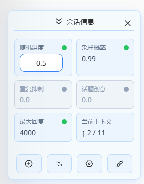
</div> -->

<div align="center">
  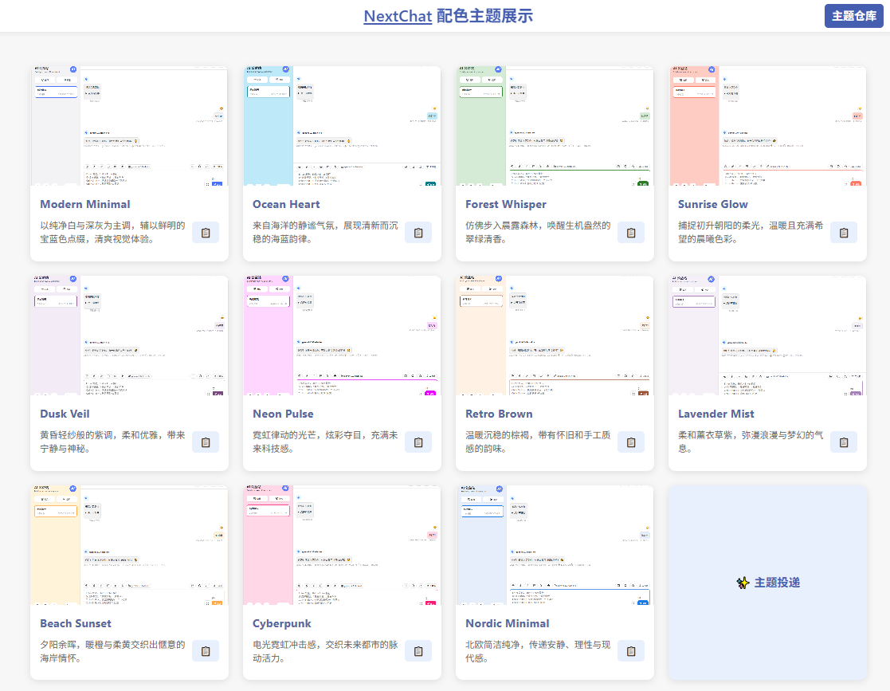
</div>

### 🔄 便捷同步与备份
- **云备份功能** - 免导入导出的数据同步（需配合[文件服务器项目](https://github.com/QAbot-zh/go-file-server)使用）

### 🤖 应用功能增强(工具箱)
- **基于 AI 模型的中英互译**

<!-- <details>
  <summary>点击展开查看截图</summary>

  <div align="center">
    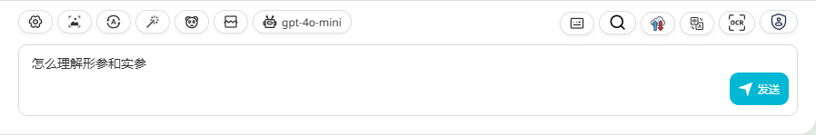
    <p align="center">翻译前</p>
    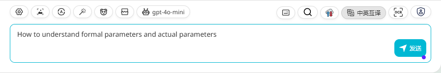
    <p align="center">翻译后</p>
  </div>
</details> -->

- **基于 AI 模型的 OCR 功能**

<!-- <details>
  <summary>点击展开查看截图</summary>

  <div align="center">
    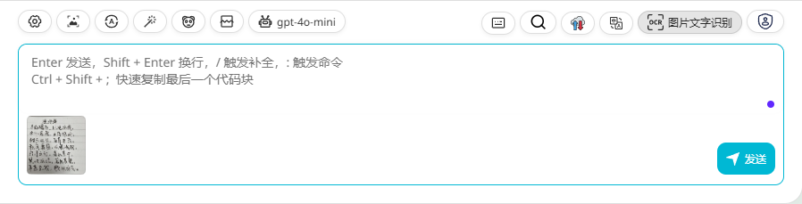
    <p align="center">OCR 前</p>
    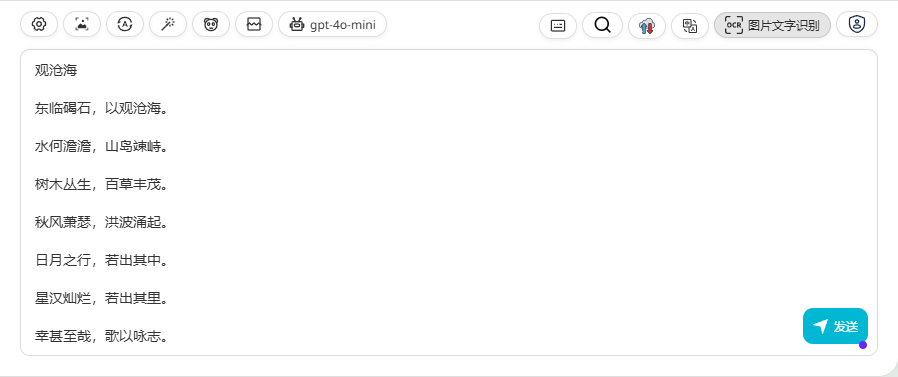
    <p align="center">OCR 后</p>
  </div>
</details> -->

- **基于 AI 模型的 提示词增强功能**

<!-- <details>
  <summary>点击展开查看截图</summary>

  <div align="center">
    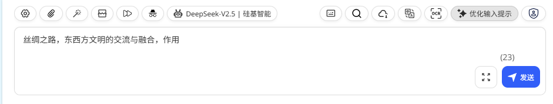
    <p align="center">优化前</p>
    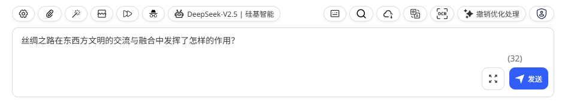
    <p align="center">优化后</p>
  </div>
</details> -->
- **输入区文本增强功能**
  - **提示词智能优化**
  - **输入文本一键清空**
  - **输入区文本批量替换**

### 🔒 隐私与安全
- **基于正则匹配的隐私打码**（注：所有基于 AI 模型的功能的信息安全请自行把握）

<!-- <details>
  <summary>点击展开查看截图</summary>

  <div align="center">
    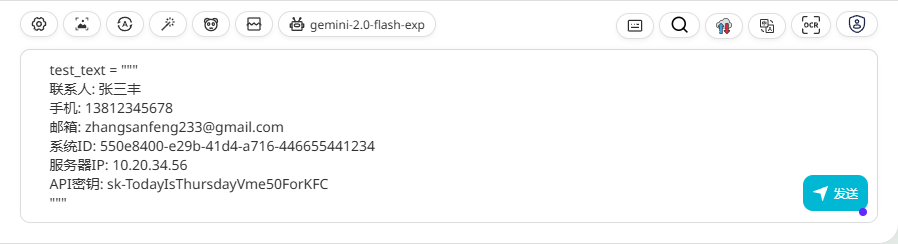
    <p align="center">打码前</p>
    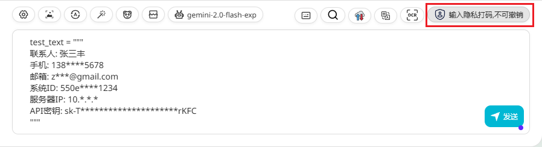
    <p align="center">打码后</p>
  </div>
</details> -->
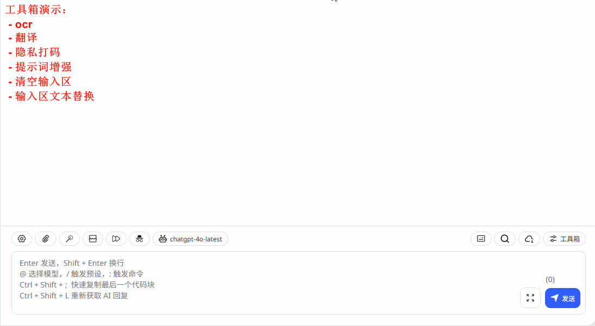

### 📊 交互与展示优化
- **支持 details/summary 标签渲染** - 增强页面整洁度与交互性

<details>
  <summary>点击展开查看截图</summary>

  <div align="center">
    
  </div>
</details>

- **思考过程可视化** - 适配 `<think>` 标签和 reasoning_content 参数

<details>
  <summary>点击展开查看截图</summary>

  <div align="center">
    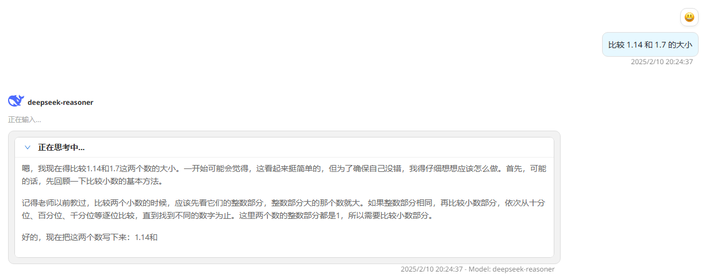
    <p align="center">思考中</p>
    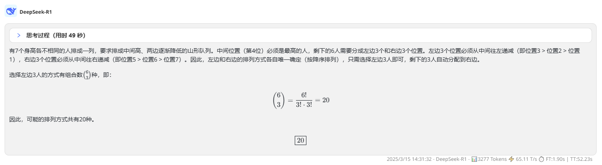
    <p align="center">思考结束（已增加思考计时）</p>
  </div>
</details>

- **回复 token 统计** - API 若未包含相关用量则以 gpt-3.5-turbo 为模型编码器计算

<details>
  <summary>点击展开查看截图</summary>

  <div align="center">
    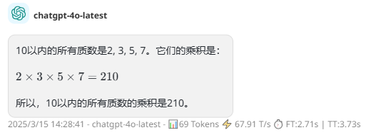
  </div>
</details>

- **快速输入规则**

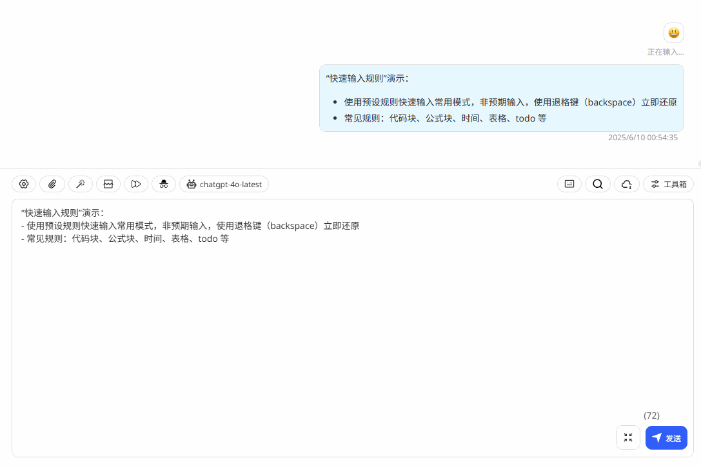


### 模型自定义功能增强
- **OpenAI 类型支持前端配置** - 一键拉取可用模型 （已停更，建议使用更加完备的【自定义 AI 提供商】功能）

<details>
  <summary>点击展开查看截图</summary>

  <div align="center">
    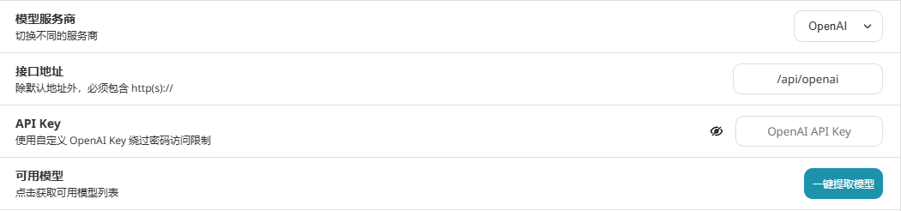
  </div>
</details>

- **自定义 AI 提供商** - 支持 OpenAI/DeepSeek/SiliconFlow 类型
  - 单渠道配置多密钥
  - 密钥列表视图，密钥测试，余额查询
  - 渠道级总余额查询
  - 移除测试无效 key
  - 拉取模型、模型测试
  - 配置模型别名和视觉支持
  - 支持配置聊天补全等路径
  - 数据集成进 store，支持云备份

<details>
  <summary>点击展开查看截图</summary>

  <div align="center">
    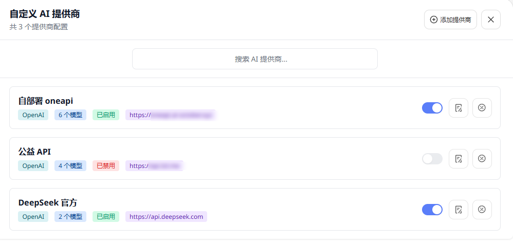
    <br><br>
    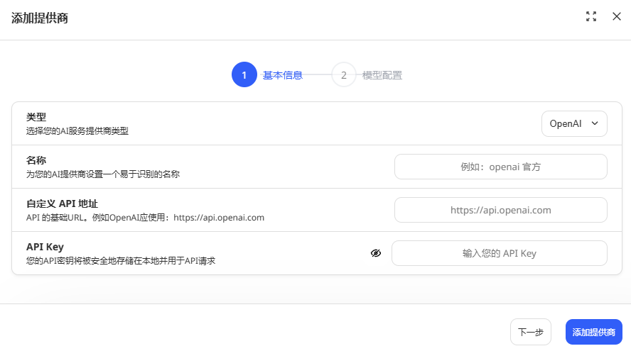
    <br><br>
    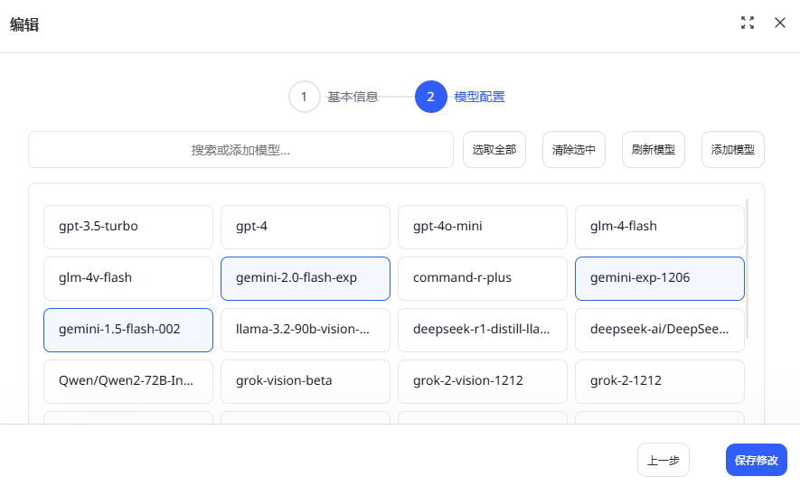
  </div>
</details>


## 环境变量

### 核心配置变量

| 环境变量名称               | 描述                                                                              | 默认值                    |
|----------------------------|-----------------------------------------------------------------------------------|---------------------------|
| `CODE`                     | 授权码，支持英文逗号分隔多个 code                                                 | -                         |
| `OPENAI_API_KEY`           | **必选**. OpenAI API 密钥，支持英文逗号分隔多个 key                              | -                         |
| `BASE_URL`                 | 自定义 OpenAI API 请求的基础 URL                                                 | `https://api.openai.com`  |
| `OPENAI_ORG_ID`            | 指定 OpenAI 组织 ID                                                              | -                         |
| `HIDE_USER_API_KEY`        | 设置为 `1` 禁止用户在前端输入自己的 API 密钥                                     | -                         |
| `DISABLE_GPT4`             | 设置为 `1` 禁止用户使用 GPT-4 及其相关高级模型                                   | -                         |
| `ENABLE_BALANCE_QUERY`     | 设置为 `1` 允许用户查询 API 余额                                                 | -                         |
| `DISABLE_FAST_LINK`        | 设置为 `1` 禁止通过 URL 解析参数                                                 | -                         |

### 自定义显示和功能变量

| 环境变量名称               | 描述                                                                              | 默认值                    |
|----------------------------|-----------------------------------------------------------------------------------|---------------------------|
| `CUSTOM_MODELS`            | 自定义模型列表                                                                    | -                         |
| `SIDEBAR_TITLE`            | 设置侧边栏标题                                                                    | -                         |
| `SIDEBAR_SUBTITLE`         | 设置侧边栏子标题，支持 HTML 解析                                                  | -                         |
| `SITE_TITLE`               | 设置网站顶部标题                                                                  | -                         |
| `COMPRESS_MODEL`           | 设置标题生成和历史压缩模型                                                        | -             |
| `TEXT_PROCESS_MODEL`       | 设置文本任务模型                                                                      | -             |
| `OCR_MODEL`                | 设置 OCR 模型                                                                     | -             |
| `CUSTOM_HELLO`             | 自定义招呼语，覆盖默认的 `bot_hello`                                              | -                         |
| `UNAUTHORIZED_INFO`        | 自定义错误提示，覆盖默认的提示词                                                  | -                         |
| `WHITE_WEBDEV_ENDPOINTS`   | 增加允许访问的 WebDAV 服务地址                                                    | -                         |
| `DEFAULT_INPUT_TEMPLATE`   | 自定义默认模板，用于初始化设置中的用户输入预处理配置项                            | -                         |
| `VISION_MODELS`            | 设置具备视觉能力的模型，多个模型用英文逗号分隔                                    | -                         |
| `ICON_POSITION`            | 设置消息功能图标的位置，候选项：UP,DOWN,BOTH                                      | `DOWN`                    |
| `SELECT_LABELS`            | 设置模型选择的标签，多个标签用英文逗号分隔                                        | -                         |
| `MODEL_PARAMS`             | 指定模型注入参数，英文逗号分隔模型，分号分隔参数，支持`*`模式匹配，格式："modelA:key1=val1;key2=val2,modelB:key3=val3"，如：`deepseek-reasoner:max_tokens=40000,gemini-2.5-flash:max_tokens=60000;temperature=0.3` | - |

### 关键配置配置示例

#### `CUSTOM_MODELS`：支持通过<>设置模型描述

<div align="center">
  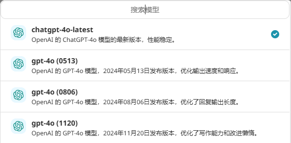
</div>

#### `SIDEBAR_SUBTITLE`：侧边栏子标题，支持HTML解析

```html
<br>
<div style="line-height: 1.8;">
   <div>AI-Chat 演示站</div>
   <div>测试侧边栏文字 HTML 解析</div>
   <a href="https://github.com/QAbot-zh/ChatGPT-Next-Web" 
      style="color: #1890ff;
               text-decoration: none;
               font-weight: 500;
               transition: all 0.3s ease;
               padding: 2px 4px;
               border-radius: 4px;
               background-color: rgba(24,144,255,0.1);">
      <span style="margin-bottom: 8px;">📦</span>Github项目
   </a>
</div>
```

<div align="center">
  
</div>

#### `ICON_POSITION` 位置示意图

<div align="center">
  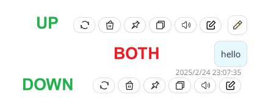
</div>

#### `SELECT_LABELS`：模型筛选标签

<div align="center">
  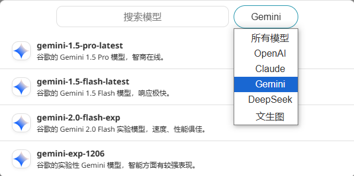
</div>

## 平台搭建
- Vercel 部署： [](https://vercel.com/new/clone?repository-url=https%3A%2F%2Fgithub.com%2FQAbot-zh%2FChatGPT-Next-Web&env=OPENAI_API_KEY&env=CODE&project-name=chatgpt-next-web&repository-name=ChatGPT-Next-Web)

- [cf pages 部署](./docs/cloudflare-pages-cn.md)

- serv00 部署
感谢 [Reno](https://linux.do/u/Reno) 奉献的教程： 
[零成本搭建可扩展的AI对话平台，含文件服务搭建](https://linux.do/t/topic/444807)

- [claw 部署](https://console.run.claw.cloud/signin?link=4TLWOT0ZFPO3)：docker 容器化部署，操作快捷


## 计划功能

- [x] 定制快捷输入规则
- [ ] 图片、视频生成等模态支持
- [ ] 支持更多模型提供商
- [ ] 混合渠道的模型负载均衡
- [ ] 插件支持
- [ ] MCP支持
- [ ] 模型竞技与模型组合

## 致谢
> 参考过创意或实现的其他项目（排名不分先后）：
> - [ChatGPTNextWeb-Langchain](https://github.com/Hk-Gosuto/ChatGPT-Next-Web-LangChain)
> - [ChatgptNextWeb-kiritoko](https://github.com/kiritoko1029/ChatGPT-Next-Web)
> - [ChatgptNextWeb-earlybird](https://github.com/Dogtiti/ChatGPT-Next-Web-EarlyBird)
> - [ChatgptNextWeb-X](https://github.com/Dakai/ChatGPT-Next-Web-X/tree/upload_doc)
> - [NeatChat](https://github.com/tianzhentech/NeatChat)

-------
## LICENSE

[MIT](https://opensource.org/license/mit/)


## Star History

[](https://www.star-history.com/#QAbot-zh/ChatGPT-Next-Web&Date)

## Sponsorship 

- User
  - [@XK3023](https://github.com/CXK3023)  